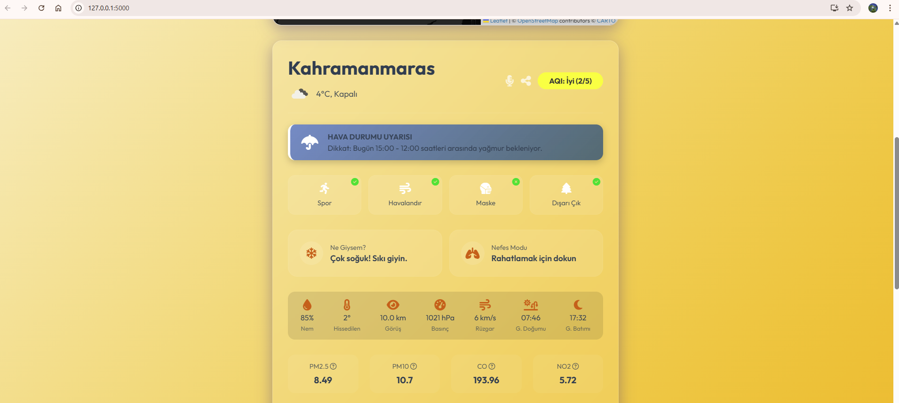
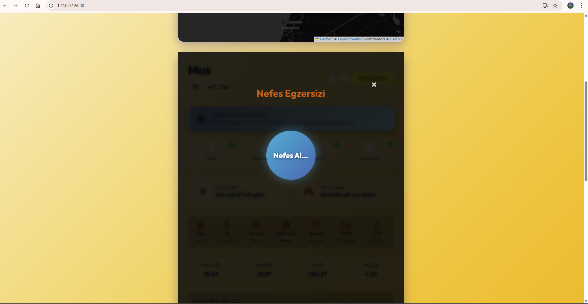
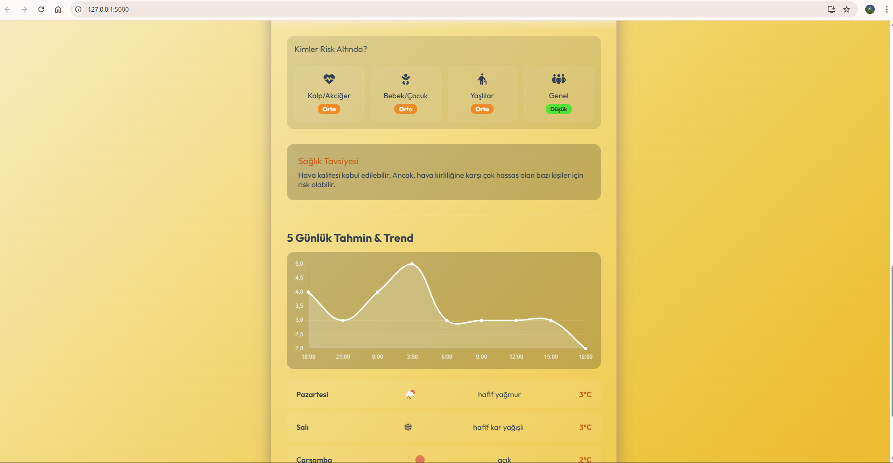
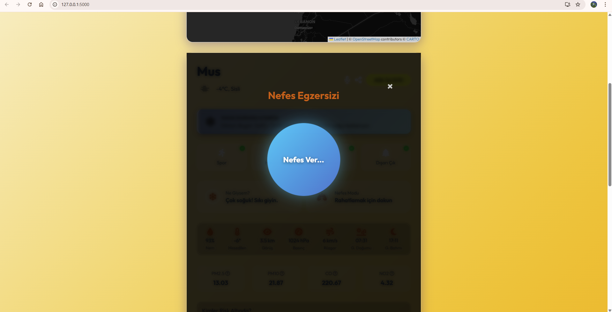

# SkyCheck - Hava Takip ve Kalite Uygulaması

SkyCheck, bulunduğunuz konumdaki veya aradığınız herhangi bir şehirdeki güncel hava durumunu, hava kalitesini ve detaylı meteorolojik verileri sunan modern bir web uygulamasıdır. Flask altyapısı ile geliştirilmiş olup, OpenWeatherMap API'lerini kullanarak anlık ve güvenilir veriler sağlar.


## 🌟 Özellikler

*   **Anlık Hava Durumu:** Sıcaklık, hissedilen sıcaklık, nem, basınç, rüzgar hızı ve görüş mesafesi gibi temel veriler.
*   **Hava Kalitesi İndeksi (AQI):** PM2.5, PM10, CO, NO2 gibi kirleticilerin detaylı analizi ve sağlık önerileri. Beş seviyeli renk kodlu risk göstergesi.
*   **İnteraktif Harita:** Leaflet.js tabanlı, katmanlı (Bulut, Yağış, Sıcaklık) hava durumu haritası. Türkiye illeri için özel vurgulamalar.
*   **5 Günlük Tahmin:** Gelecek günler için detaylı hava tahmini ve sıcaklık değişim grafiği (Chart.js).
*   **Konum Bazlı Hizmet:** Tarayıcı üzerinden "Konumumu Bul" özelliği ile otomatik veri getirme.
*   **Yaşam Tarzı Önerileri:**
    *   **Kıyafet Önerisi:** Sıcaklığa göre ne giymeniz gerektiği (Örn: "Tișört giy", "Mont al").
    *   **Aktivite Rehberi:** Spor, havalandırma ve dışarı çıkma gibi aktiviteler için uygunluk durumu.
    *   **Risk Grupları:** Hava kalitesine göre hassas gruplar (çocuklar, yaşlılar vb.) için uyarılar.
*   **Nefes Egzersizi:** Stres atmak veya odaklanmak için entegre, görsel yönlendirmeli nefes alma modülü.
*   **Sesli Asistan:** Hava durumu raporunu sesli olarak okuma özelliği.
*   **Favoriler:** Sık takip ettiğiniz şehirleri favorilere ekleme ve hızlı erişim.

## 🛠️ Teknolojiler

*   **Backend:** Python, Flask
*   **Frontend:** HTML5, CSS3, JavaScript (ES6+)
*   **Veri Kaynağı:** OpenWeatherMap API (Current Weather, Air Pollution, 5 Day Forecast, Geocoding, Maps)
*   **Kütüphaneler:**
    *   [Leaflet.js](https://leafletjs.com/) (Harita)
    *   [Chart.js](https://www.chartjs.org/) (Grafikler)
    *   [FontAwesome](https://fontawesome.com/) (İkonlar)

## 🚀 Kurulum ve Çalıştırma

Bu projeyi kendi bilgisayarınızda çalıştırmak için aşağıdaki adımları izleyin.

### Gereksinimler
*   Python (3.x sürümü önerilir)
*   OpenWeatherMap API Anahtarı (Ücretsiz alınabilir)

### Adım 1: Projeyi İndirin
Projeyi bilgisayarınıza indirin veya klonlayın.

### Adım 2: API Anahtarını Ayarlayın
Proje kök dizininde `.env` adında bir dosya oluşturun ve içine kendi API anahtarınızı yazın:

```
OPENWEATHER_API_KEY=senin_api_anahtarin_buraya
```

### Adım 3: Çalıştırın

**Kolay Yöntem (Windows):**
Proje klasöründeki `baslat.ps1` dosyasına sağ tıklayıp "PowerShell ile Çalıştır" diyebilirsiniz. Bu script:
1.  Gerekli kütüphaneleri (`requirements.txt`) kontrol eder ve yükler.
2.  Sunucuyu başlatır.
3.  Tarayıcınızı otomatik olarak açar.

**Manuel Yöntem:**
Terminale şu komutları girin:

```bash
# Gerekli paketleri yükleyin
pip install -r requirements.txt

# Uygulamayı başlatın
python app.py
```

Tarayıcınızda `http://127.0.0.1:5000` adresine giderek uygulamayı kullanabilirsiniz.

## 📂 Proje Yapısı

*   `app.py`: Flask ana uygulama dosyası. Backend routing ve API isteklerini yönetir.
*   `templates/index.html`: Ana sayfa HTML şablonu.
*   `static/`: CSS, JavaScript ve görsel dosyaların bulunduğu klasör.
    *   `css/style.css`: Stil dosyası.
    *   `js/script.js`: Frontend mantığı, API çağrıları, harita ve grafik yönetimi.
*   `baslat.ps1`: Otomatik başlatma scripti.

## 📸 Ekran Görüntüleri

### Uygulama İçi Görseller
| Açıklamalar | Nefes Egzersizi |
|:---:|:---:|
|  |  |
|  |  |
